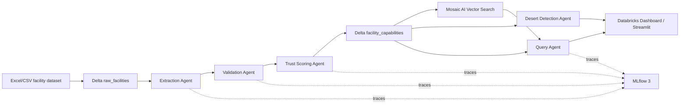

# CareMap AI: Agentic Healthcare Intelligence System for India

CareMap AI is a Databricks-first hackathon system for reasoning over noisy healthcare facility data. It extracts clinical capabilities, validates contradictions, assigns trust scores, answers complex natural-language queries, and identifies medical deserts across India.

The project is intentionally conservative: facility claims are treated as incomplete, messy, and potentially wrong. Every answer is expected to show evidence snippets and reasoning steps.

## Architecture



## Agents

- **Extraction Agent:** rule-first extraction from `description`, `specialties`, `procedure`, `equipment`, and `capability`; optional Agent Bricks / Model Serving repair for ambiguous rows.
- **Validation Agent:** contradiction checks such as surgery without anesthesiologist, ICU without oxygen or ventilator, and emergency claims without 24/7 evidence.
- **Trust Scoring Agent:** interpretable 0-100 score with explicit additions and penalties.
- **Query Agent:** parses intent, filters extracted capabilities, ranks by trust, distance, capability match, and contradiction penalties.
- **Desert Detection Agent:** groups by state, district/city, and PIN code to identify high-risk service gaps.

## Databricks Run Path

1. Upload this repo to Databricks Repos as `/Workspace/Repos/caremap-ai`.
2. Upload the dataset to a Unity Catalog volume, for example:
   `/Volumes/workspace/caremap_ai/raw/facilities.xlsx`
3. Run notebooks in order:
   - `notebooks/00_setup_and_ingest.py`
   - `notebooks/01_agent_pipeline.py`
   - `notebooks/02_vector_search.py`
   - `notebooks/03_query_agent.py`
   - `notebooks/04_desert_dashboard_sql.py`
4. Create a Databricks dashboard from:
   - `workspace.caremap_ai.facility_capabilities`
   - `workspace.caremap_ai.medical_deserts`
5. Enable Genie on the dashboard or create a Genie space over the two tables for natural-language exploration.

## Databricks Ecosystem Mapping

- **Data processing:** Databricks notebooks with pandas/PySpark, Delta tables.
- **Agentic orchestration:** Genie Code Agent mode can inspect and run the notebook pipeline, iterate on data quality, and create dashboard queries.
- **LLM inference:** optional Agent Bricks / Model Serving endpoint in `01_agent_pipeline.py`.
- **Information extraction:** Agent Bricks Information Extraction can be used to optimize the extraction schema; the rule-first agent remains the deterministic baseline.
- **Vector search:** Mosaic AI Vector Search Delta Sync index over `embedding_text`.
- **Observability:** MLflow 3 traces and runs around extraction, validation, scoring, and query execution.
- **Governance:** Unity Catalog tables and privileges.

Useful Databricks docs:

- [Mosaic AI Vector Search setup](https://docs.databricks.com/aws/en/vector-search/create-vector-search)
- [MLflow Tracing for generative AI observability](https://docs.databricks.com/en/mlflow/mlflow-tracing.html)
- [Agent Bricks](https://docs.databricks.com/aws/en/generative-ai/ai-builder/)
- [Agent Bricks Information Extraction](https://docs.databricks.com/aws/en/generative-ai/agent-bricks/info-extraction)
- [Genie Code](https://docs.databricks.com/aws/en/notebooks/databricks-assistant-faq)
- [Agent mode in Genie spaces](https://docs.databricks.com/aws/en/genie/research-agent)

## Exact Input Schema

The ingestion notebook enforces the requested columns exactly:

`name, phone_numbers, officialPhone, email, websites, officialWebsite, yearEstablished, facebookLink, twitterLink, linkedinLink, instagramLink, address_line1, address_line2, address_line3, address_city, address_stateOrRegion, address_zipOrPostcode, address_country, address_countryCode, facilityTypeId, operatorTypeId, affiliationTypeIds, description, numberDoctors, capacity, specialties, procedure, equipment, capability, recency_of_page_update, distinct_social_media_presence_count, affiliated_staff_presence, custom_logo_presence, number_of_facts_about_the_organization, post_metrics_most_recent_social_media_post_date, post_metrics_post_count, engagement_metrics_n_followers, engagement_metrics_n_likes, engagement_metrics_n_engagements, latitude, longitude`

## Local Demo

Local mode is only a fallback for development and judging convenience.

```bash
python -m venv .venv
source .venv/bin/activate
pip install -r requirements-local.txt
streamlit run app/streamlit_app.py
```

The local demo uses `data/sample_facilities.csv`, the deterministic agents, and a pandas/Streamlit interface.

## Demo Queries

- Emergency surgery in rural Bihar
- Dialysis centers in underserved regions
- Trauma care facilities with high trust score
- Regions with no ICU access
- Find nearest facility in Bihar that can perform emergency appendectomy and has oxygen and ICU support

## Expected Outputs

Each recommendation includes:

- Ranked facility name and location
- Trust score and confidence score
- Contradiction flags
- Exact extracted evidence snippets
- Plain-English scoring explanation
- Query reasoning steps

## Notes for Judges

This is not keyword search. The system first converts noisy text into structured clinical capability claims, then performs self-correction and trust scoring before query ranking. Contradictions lower trust even when a keyword match exists.
